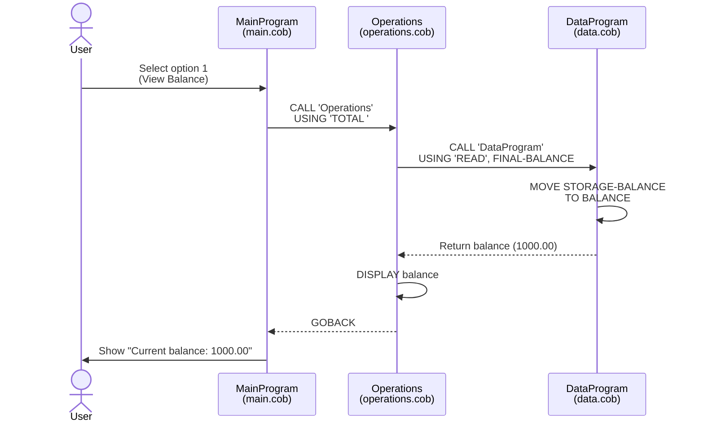
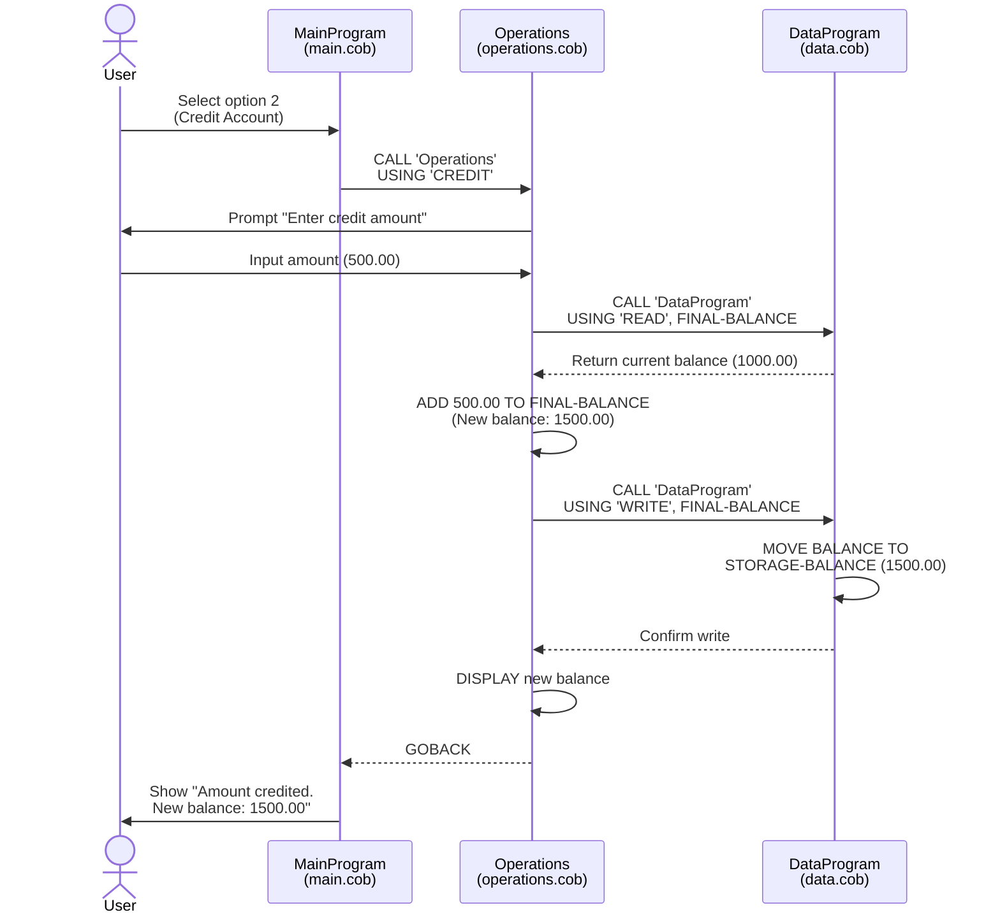
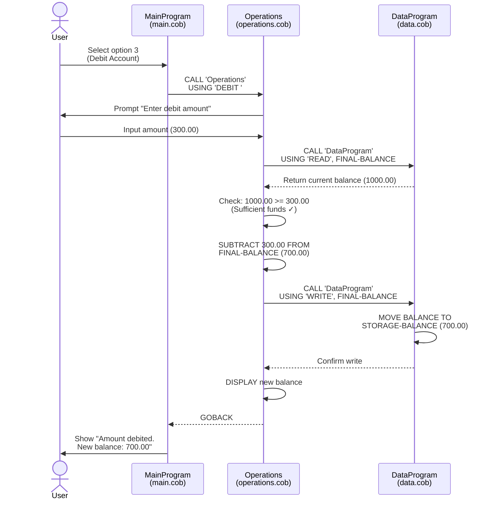
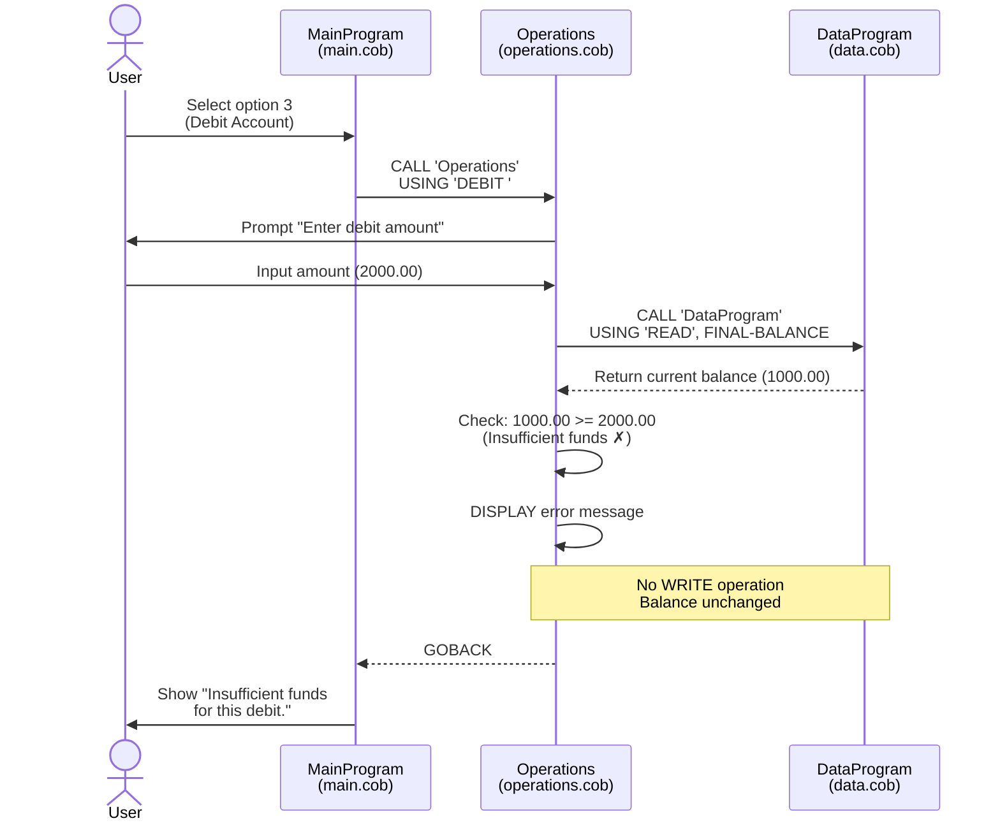
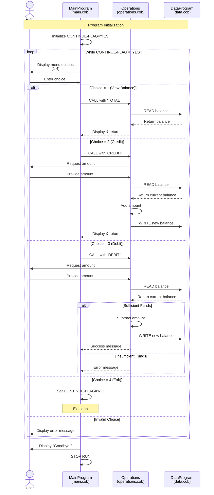

# COBOL Account Management System Documentation

## Overview

This is a legacy COBOL-based Account Management System designed to manage student account balances. The system provides basic banking operations including balance inquiry, credits (deposits), and debits (withdrawals).

## System Architecture

The application follows a modular architecture with three main components:

```
┌──────────────┐
│   main.cob   │  ← Entry Point & User Interface
└──────┬───────┘
       │
       ↓
┌──────────────┐
│operations.cob│  ← Business Logic Layer
└──────┬───────┘
       │
       ↓
┌──────────────┐
│   data.cob   │  ← Data Persistence Layer
└──────────────┘
```

## File Documentation

### 1. main.cob - Main Program Entry Point

**Purpose:**
- Serves as the main entry point and user interface for the Account Management System
- Displays an interactive menu for account operations
- Routes user commands to the appropriate operation handlers

**Key Functions:**
- `MAIN-LOGIC`: Main program loop that continues until the user chooses to exit
  - Displays menu options (View Balance, Credit Account, Debit Account, Exit)
  - Accepts user input (1-4)
  - Routes commands to the Operations module based on user choice
  - Validates input and displays error messages for invalid choices

**Data Structures:**
- `USER-CHOICE` (PIC 9): Stores the user's menu selection
- `CONTINUE-FLAG` (PIC X(3)): Controls the main program loop (YES/NO)

**Program Flow:**
1. Display menu options
2. Accept user input
3. Evaluate choice and call appropriate operation
4. Repeat until user selects exit

---

### 2. operations.cob - Business Logic Module

**Purpose:**
- Implements the core business logic for all account operations
- Validates business rules before executing transactions
- Acts as an intermediary between the user interface and data layer

**Key Functions:**

1. **TOTAL Operation** - View Current Balance
   - Retrieves current balance from DataProgram
   - Displays balance to user
   - No validation required

2. **CREDIT Operation** - Deposit Funds
   - Prompts user for credit amount
   - Reads current balance
   - Adds credit amount to balance
   - Writes updated balance back to data store
   - Displays new balance

3. **DEBIT Operation** - Withdraw Funds
   - Prompts user for debit amount
   - Reads current balance
   - **Validates sufficient funds** (business rule)
   - If sufficient: subtracts amount and updates balance
   - If insufficient: displays error message and cancels transaction
   - Displays result

**Data Structures:**
- `OPERATION-TYPE` (PIC X(6)): Stores the operation type (TOTAL, CREDIT, DEBIT)
- `AMOUNT` (PIC 9(6)V99): Stores transaction amounts (up to 999,999.99)
- `FINAL-BALANCE` (PIC 9(6)V99): Working storage for balance calculations

**Business Rules Implemented:**
- Debit transactions require sufficient funds (balance >= debit amount)
- All amounts are stored with 2 decimal places for currency precision
- Maximum transaction/balance amount: $999,999.99

---

### 3. data.cob - Data Persistence Module

**Purpose:**
- Manages the persistent storage of account balance data
- Provides READ and WRITE operations for balance retrieval and updates
- Acts as a simple database layer

**Key Functions:**

1. **READ Operation**
   - Returns the current stored balance
   - Copies `STORAGE-BALANCE` to the passed parameter

2. **WRITE Operation**
   - Updates the stored balance
   - Copies the passed parameter to `STORAGE-BALANCE`

**Data Structures:**
- `STORAGE-BALANCE` (PIC 9(6)V99): Persistent storage for account balance
  - Initial value: $1,000.00 (default starting balance)
- `OPERATION-TYPE` (PIC X(6)): Determines whether to READ or WRITE

**Storage Characteristics:**
- Balance persists in memory during program execution
- Initial balance set to $1,000.00
- Maximum storage capacity: $999,999.99

---

## Student Account Business Rules

### Initial Account Setup
- **Default Balance**: Every student account starts with an initial balance of $1,000.00
- **Account Type**: Single account per student (no multiple account types)

### Transaction Rules

#### Credit (Deposit) Transactions
- **Allowed Amount**: $0.01 to $999,999.99
- **Validation**: Accepts any positive amount within the system limit
- **Balance Update**: Immediate upon successful transaction
- **No Upper Limit Check**: System does not enforce a maximum balance

#### Debit (Withdrawal) Transactions
- **Allowed Amount**: $0.01 to current balance
- **Validation**: 
  - Must have sufficient funds (balance >= debit amount)
  - Transaction rejected if insufficient funds
- **Balance Update**: Immediate upon successful transaction
- **Overdraft**: Not permitted - strict non-negative balance enforcement

#### Balance Inquiry
- **Access**: Unlimited balance checks
- **No Fee**: Balance inquiries are free and do not modify the account
- **Display Format**: Shows balance in decimal format (e.g., 1000.00)

### Data Integrity Rules
- **Precision**: All monetary values stored with 2 decimal places
- **Data Type**: Numeric with implicit decimal point (PIC 9(6)V99)
- **Atomicity**: Each transaction is atomic (all-or-nothing)
- **Consistency**: Balance always reflects the result of all completed transactions

### System Limitations
- **Maximum Balance**: $999,999.99
- **Maximum Transaction**: $999,999.99
- **Decimal Places**: Fixed at 2 decimal places
- **Concurrency**: Single-user system (no concurrent transaction support)

---

## Usage Example

```
--------------------------------
Account Management System
1. View Balance
2. Credit Account
3. Debit Account
4. Exit
--------------------------------
Enter your choice (1-4): 1
Current balance: 1000.00

Enter your choice (1-4): 2
Enter credit amount: 500.00
Amount credited. New balance: 1500.00

Enter your choice (1-4): 3
Enter debit amount: 2000.00
Insufficient funds for this debit.

Enter your choice (1-4): 3
Enter debit amount: 500.00
Amount debited. New balance: 1000.00

Enter your choice (1-4): 4
Exiting the program. Goodbye!
```

---

## Technical Notes

### Module Communication
- **CALL Statement**: Used for inter-program communication
- **USING Clause**: Passes parameters between programs
- **LINKAGE SECTION**: Defines parameters received from calling programs
- **GOBACK**: Returns control to calling program

### Data Format
- **PIC 9(6)V99**: 
  - 6 digits before decimal point
  - 2 digits after decimal point
  - V indicates implied decimal position
  - Total capacity: $999,999.99

### Error Handling
- Invalid menu choices display error message
- Insufficient funds prevent debit transactions
- Input validation occurs at operation level

---

## Modernization Considerations

When modernizing this legacy system, consider:

1. **Database Integration**: Replace in-memory storage with persistent database
2. **Transaction Logging**: Add audit trail for all account operations
3. **Multi-user Support**: Implement concurrency control and locking mechanisms
4. **Enhanced Validation**: Add input validation for negative numbers, non-numeric input
5. **Security**: Add authentication and authorization
6. **Error Handling**: Implement comprehensive error handling and recovery
7. **API Layer**: Consider RESTful API for modern integration
8. **Testing**: Add unit tests and integration tests
9. **Configuration**: Externalize business rules (initial balance, limits)
10. **Reporting**: Add transaction history and reporting capabilities

---

## File Locations

- Main Program: `src/cobol/main.cob`
- Operations Module: `src/cobol/operations.cob`
- Data Module: `src/cobol/data.cob`

---

## System Data Flow - Sequence Diagrams

### View Balance Operation



### Credit Account Operation (Successful)



### Debit Account Operation (Successful)



### Debit Account Operation (Insufficient Funds)



### Complete User Session Flow



---

*Last Updated: February 9, 2026*
